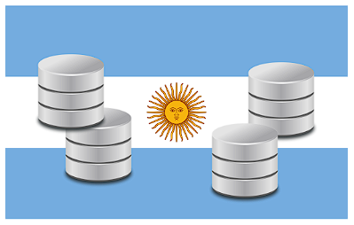
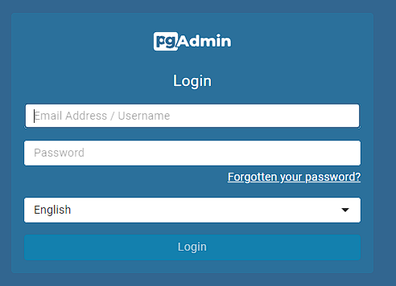
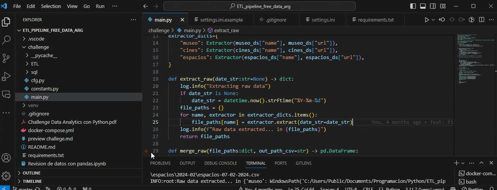

# Flujo ETL para datos libres de ARGENTINA



-----------------------------------------------------------------------------------------------------------

# Descripción

Pipeline capaz de leer, transformar y normalizar datos para luego cargarlos en una base de datos automáticamente. El objetivo de este proyecto es realizar el challenger de ingeniero de datos propuesto por [Alkemy](https://www.google.com/url?q=https://www.alkemy.org/&amp;sa=D&amp;source=editors&amp;ust=1707360715372592&amp;usg=AOvVaw0p-9OgUukTXV13tUqYBf1w), el challenger se encuentra descrito en este [pdf](https://www.google.com/url?q=https://github.com/joankenobi/ETL_pipeline_free_data_arg/blob/master/Challenge%2520Data%2520Analytics%2520con%2520Python.pdf&amp;sa=D&amp;source=editors&amp;ust=1707360715372770&amp;usg=AOvVaw2nzj6GcB8QhwBuqEt_I0wF).

# Aplicación

Como se usa…

# Instalación

Requerimientos:

- Python 3.10+
- Docker
- github

- Paso 1 en terminal:

```sh

        git clone https://github.com/joankenobi/ETL\_pipeline\_free\_data\_arg.git

```

- Paso 2 en terminal win:

```sh

        python3 -m venv venv

        venv\Scripts\activate

        pip install -r requirements.txt

```

- Paso 3 correr docker compose:

```sh

        docker-compose up

```

- Paso 4 correr abrir administrador de postgres:

En algún browser abrir [http://localhost:80](https://www.google.com/url?q=http://localhost:80&amp;sa=D&amp;source=editors&amp;ust=1707360715374116&amp;usg=AOvVaw3t46heilJvjvuXn9M1FLMC)

Ingresar user y contraseña configurada en el documento [docker-compose.yml](https://www.google.com/url?q=https://github.com/joankenobi/ETL_pipeline_free_data_arg/blob/master/docker-compose.yml&amp;sa=D&amp;source=editors&amp;ust=1707360715374338&amp;usg=AOvVaw3wPrAN1P3riUF3MdeAmQRZ)



- Paso 5

Copiar y actualizar los datos en settings.ini

Ejecutar main.py



En el gif se observa cómo extrae, organiza y guarda los datos.

<div class="badge-base LI-profile-badge" data-locale="es_ES" data-size="medium" data-theme="light" data-type="VERTICAL" data-vanity="joan-blanco" data-version="v1"><a class="badge-base__link LI-simple-link" href="https://ve.linkedin.com/in/joan-blanco?trk=profile-badge">Joan Blanco</a></div>
              